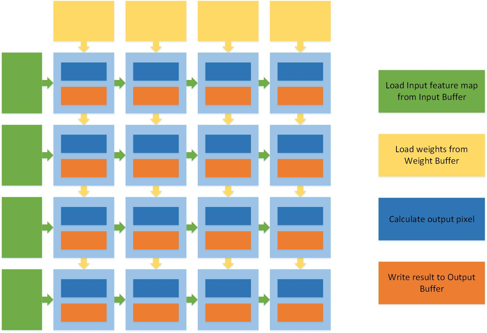
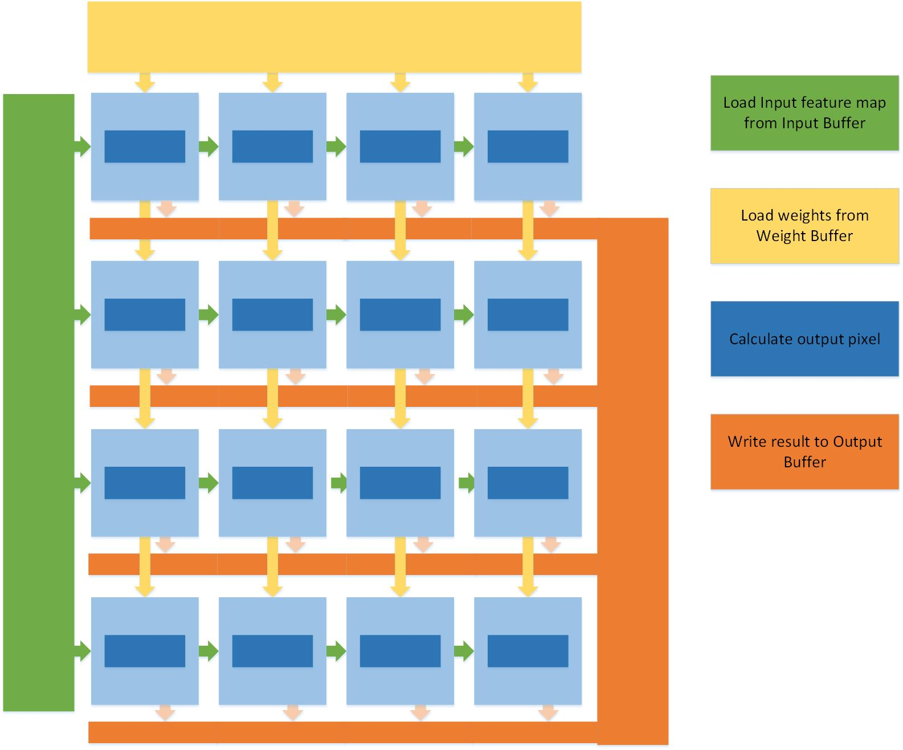

# Convor
A Practical Project of Accelerator on FPGA for Xilinx Winter Camp.

I have learned some technics about useing HLS to reorganize the C++ code to generate efficient accelerator on FPGA. And I am interested in accelerating the inference of CNN model on embedded platforms. In addition, the tutorial from CECA of PKU which has introduced some basic idea of convolution accelerator. So, I decide to perfect the design in the tutorial by adding some components including buffer management, pooling layer, full connection layer and so on. The target is to accelerate the tiny-yolov2 model on the ZCU104 platform since the brief architecture of tiny-yolov2 can simplify many problems. If there is enough time, I would like to try using data quantification that it can take advantage of the int8 to replace the float data type, as well as drawing support from Vitis vision library to accelerate the preprocess of input image.

# Progress
By the end of February, I have completed the construction of configurable convolution function based on systolic array for various input and output sizes. This will help me to explore the design space for specific network in the next future.

# Using Systolic Array implement flexible convolution kernel

As shown in the picture above, in the primitive design, the structure of Systolic Array is straightforward. Each PE perform MACC on the input data that are passed form the previous processers. Every row of the Systolic Array produces the one corresponding row of the output feature map, ans every colum of it produces the one corresponding channel of the output feature map. The Systolic Array has M rows and N colums, a slice of output feature map which has M rows, N channels and all colums can be calculated at one time. As a result，the slice of input feature map which is needed for producing the corresponding row of the output feature map is supposed to flow along the row of the Systolic Array, the slice of weights which is needed for producing the corresponding channel of the output feature map should flow along the colum. Then I split the logic of loading data from the PE , for the preprocess that the function calculates the location of data used for each row or colum in Input Buffer or Weight Buffer needs a lot of computation. In general, the basic idea of using Systolic Array implement convolution is to unroll the output row loop with a factor of M and unroll the output channel loop with a factor of N.
However, 

```
Input: In_ddr, W_ddr, Out_ddr, Rin, Cin, CHin, Rout, Cout, CHout, padding, stride
/*
* In_ddr: Memory address of input feature map 
* W_ddr: Memory address of weights for convolution
* Out_ddr: Memory address of output feature map
* Rin: # of row of input feature map
* Cin: # of col of input feature map
* CHin: # of channel of input feature map
* Rout: # of row of output feature map
* Cout: # of col of output feature map
* CHout: # of channel of output feature map
* padding: # of padding pixel on the edge of input feature map
* stride: The step size of convolution window moving
*/
Input Buffer[Input_Buffer_Size];
Weight Buffer[Input_Buffer_Size];
Output Buffer[Input_Buffer_Size];

M <- # of row of Systolic Array // M represents the parallelism of producing output row
N <- # of col of Systolic Array // N represents the parallelism of producing output channel

output_row <- 0 // output_row records the # of produced output row 
output_channel <- 0 // output_channel records the # of produced output col
input_row <- 0 // input_row records the start index of the input row needed for next convolution process
reuse_row <- 0 //reuse_row records the # of row in the Input Buffer which can be reused in the next convolution process
read_row_origin <- (M - 1) * stride + K // read_row_origin represents the # of input row needed for every convolution process
read_row_ddr <- 0 // read_row_ddr records the # of row read from DDR to Input Buffer
input_channel <- 0 // input_channel records the start index of the iput channel needed for next convolution process
Read All weights from DDR to Weight Buffer.
while output_row < Rout do
  read_row_ddr = read_row_origin - reuse_row  
  According to the information of input_row & read_row_ddr, read required slices of input feature map form DDR into Input Buffer.
  output_channel <- 0
  while output_channel < CHout do
    Lunch Systolic Array to complete the convolution process and write the result into Output Buffer.
    output_channel <- output_channel + N
  end
  Write the slices of output feature map back to DDR.
  out_row <- output_row + M
  input_row <- input_row + stride * M
end
```

